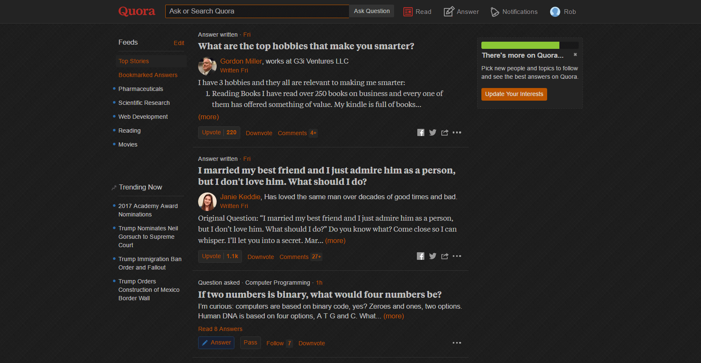

  
   
  
  
  
  
  

- Install from [userstyles.org](https://userstyles.org/styles/104706) (with customization options) or [manually](https://raw.githubusercontent.com/StylishThemes/Quora-Dark/master/quora-dark.css).
- Stylus is available for [Firefox](https://addons.mozilla.org/en-US/firefox/addon/styl-us/), [Chrome](https://chrome.google.com/webstore/detail/stylus/clngdbkpkpeebahjckkjfobafhncgmne) and [Opera](https://addons.opera.com/en-gb/extensions/details/stylus/).
- Stylish is available for [Firefox](https://addons.mozilla.org/en-US/firefox/addon/2108/), [Chrome](https://chrome.google.com/extensions/detail/fjnbnpbmkenffdnngjfgmeleoegfcffe), [Opera](https://addons.opera.com/en/extensions/details/stylish/), [Safari](http://sobolev.us/stylish/) and [Firefox Mobile](https://addons.mozilla.org/en-US/firefox/addon/2108/).

## Preview

## Contributions

If you would like to contribute to this repository, please...

1. Fork
2. Make changes (please read the [contribution guidelines](https://github.com/StylishThemes/Quora-Dark/blob/master/CONTRIBUTING.md) and abide by them)
3. Create a pull request!

Thanks to all that have [contributed](https://github.com/StylishThemes/Quora-Dark/graphs/contributors) so far!

## Changelog

### Version 1.2.6 (2018-02-02)

* Add survey styling.
* Meta:
  * Update dependencies (x2).
  * Update authors.

### Version 1.2.5 (2017-11-19)

* Darken overlay. Fixes [issue #18](https://github.com/StylishThemes/Quora-Dark/issues/18).
* Update Stats page styling. Fixes [issue #21](https://github.com/StylishThemes/Quora-Dark/issues/21).
* Fix background of "What is your question?" box. See [PR #23](https://github.com/StylishThemes/Quora-Dark/pull/23); thanks [@vallovic](https://github.com/vallovic)!
* Add style for matched_term. See [PR #24](https://github.com/StylishThemes/Quora-Dark/pull/24); thanks [@caisah](https://github.com/caisah)!
* Profile: Remove background color of pager. Fixes [issue #22](https://github.com/StylishThemes/Quora-Dark/issues/22).
* Session: Fix background styles.

### Version 1.2.4 (2017-07-18)

* Readme:
  * Add Stylus Firefox addon link.
  * Add Stylus for Opera.
* Make panel header background transparent. Fixes [issue #14](https://github.com/StylishThemes/Quora-Dark/issues/14).
* Add background to folded replies. Fixes [issue #15](https://github.com/StylishThemes/Quora-Dark/issues/15).
* Remove carousel background. Fixes [issue #16](https://github.com/StylishThemes/Quora-Dark/issues/16).
* Remove background from bookmarked answers. Fixes [issue #17](https://github.com/StylishThemes/Quora-Dark/issues/17).
* Style message popup.
